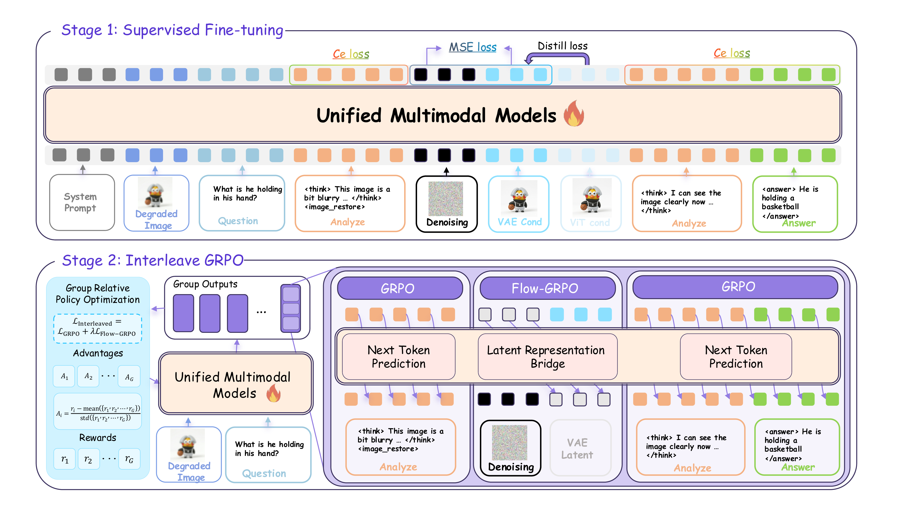
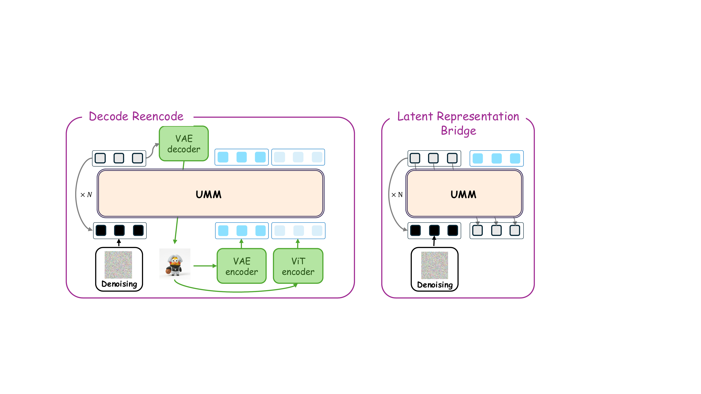
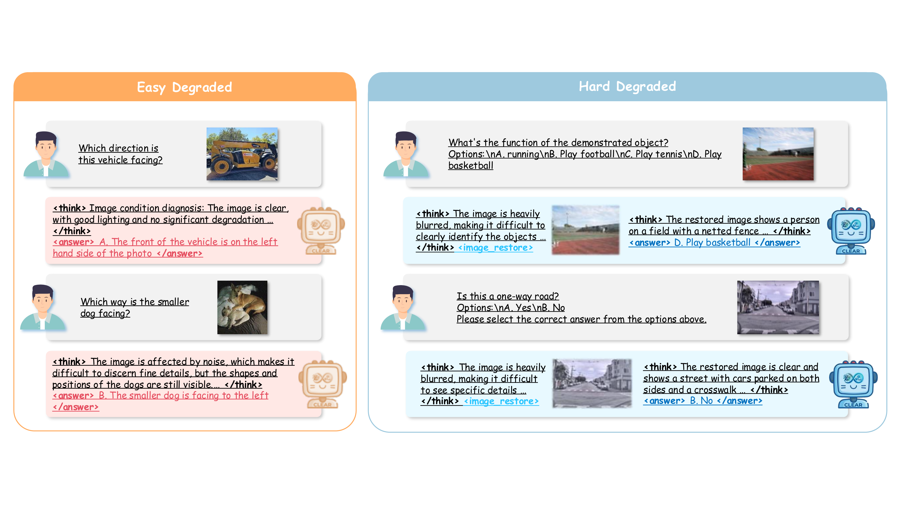

# CLEAR: Unlocking Generative Potential for Degraded Image Understanding in Unified Multimodal Models

<p align="center">
  <a href="https://arxiv.org/abs/2604.04780">
    
  </a>
  <a href="https://haoxiangzhao12138.github.io/CLEAR/">
    
  </a>
  <a href="https://huggingface.co/CUDAOUTOFMEMORY/CLEAR">
    
  </a>
  <a href="https://huggingface.co/datasets/CUDAOUTOFMEMORY/MMD-Bench">
    
  </a>
</p>

Official implementation of **CLEAR**, a unified multimodal model that leverages generative capabilities (image restoration) to improve visual understanding of degraded images.

> Existing multimodal large models suffer significant performance drops on degraded images. CLEAR introduces an **interleaved reasoning** paradigm: the model learns to *adaptively decide* whether to invoke image restoration before answering, through a three-stage training pipeline.

## Method

Built on the [BAGEL](https://github.com/ByteDance-Seed/BAGEL) framework, CLEAR proposes a three-stage pipeline:

1. **Stage 1 -- SFT**: Corruption-aware supervised fine-tuning with interleaved `<think>` / `<image_restore>` / `<answer>` reasoning.
2. **Stage 2 -- Bridge Training**: A latent representation bridge that maps denoised VAE latents directly back into the LLM's token space, avoiding costly decode-reencode.
3. **Stage 3 -- Interleaved GRPO**: Group Relative Policy Optimization with four rewards (accuracy, format, decision, latent quality) to jointly optimize reasoning, generation, and restoration decisions.

<p align="center">
  
</p>

<details>
<summary><b>Latent Representation Bridge (Stage 2)</b></summary>
<p align="center">
  
</p>
The bridge module directly maps denoised latent tokens into the LLM's understanding space, avoiding the two-step decode-then-reencode overhead of prior approaches.
</details>

## Main Results

CLEAR achieves state-of-the-art performance on degraded image understanding, outperforming both closed-source and open-source models on the MMD-Bench (Hard) benchmark:

| Method | MMBench | MM-Vet | MMVP | CV-Bench | MMStar | RealWorldQA | R-Bench-Dis | AVG |
|--------|---------|--------|------|----------|--------|-------------|-------------|-----|
| *Closed-source* | | | | | | | | |
| GPT-4o-mini | 67.02 | 50.91 | 64.00 | 59.87 | 45.93 | 58.95 | 61.21 | 58.27 |
| GPT-4.1-mini | 76.08 | 51.88 | 71.00 | 74.96 | 60.73 | 72.41 | 72.52 | 68.51 |
| Gemini-2.5-Flash | 79.33 | 66.55 | 72.33 | 76.01 | 62.00 | 69.15 | 72.72 | 71.16 |
| *Open-source unified* | | | | | | | | |
| Emu3 | 53.71 | 21.51 | 65.00 | 58.34 | 42.06 | 52.55 | 55.15 | 49.76 |
| Janus-Pro | 55.57 | 31.33 | 52.66 | 66.75 | 41.53 | 43.52 | 49.09 | 48.64 |
| Bagel | 67.88 | 45.09 | 65.66 | 64.81 | 55.53 | 58.43 | 61.64 | 60.15 |
| *CLEAR (ours)* | | | | | | | | |
| CLEAR-SFT | 72.06 | 47.56 | 70.33 | 70.51 | 57.67 | 60.13 | 65.65 | 63.42 |
| **CLEAR-RL** | **72.52** | **51.97** | **71.33** | **72.25** | **60.67** | **61.05** | **67.07** | **65.26** |

CLEAR-RL reduces the performance drop from clean to degraded images by **27%** compared to the Bagel backbone (5.31 vs. 7.29 avg score drop).

## Qualitative Examples

CLEAR adaptively decides whether to invoke image restoration based on degradation severity:

<p align="center">
  
</p>

---

## Project Structure

```
CLEAR/
├── modeling/                # Model architecture (BAGEL + Qwen2 + SigLIP + VAE)
├── data/                    # Dataset classes and configs
│   ├── configs/             # Training dataset YAML configs
│   ├── corruption_datasets_create/  # MMD-Bench data generation scripts
│   └── interleave_datasets/         # Interleaved reasoning dataset classes
├── train/                   # Training code
│   ├── pretrain_unified_corruption.py  # Stage 1: SFT entry point
│   └── grpo/                # Stage 3: GRPO RL training
├── scripts/                 # Launch scripts
├── VLMEvalKit/              # Evaluation framework (customized)
├── transformers-4.54.0/     # Vendored HuggingFace Transformers (with custom modifications)
├── trl/                     # Vendored TRL (with custom modifications)
├── inferencer.py            # Inference engine (interleaved reasoning + image generation)
├── prompts.py               # System prompt templates
├── demo.py                  # Standalone inference demo
└── requirements.txt
```

---

## Quick Start

### 1. Environment Setup

```bash
git clone https://github.com/haoxiangzhao12138/CLEAR.git
cd CLEAR

conda create -n clear python=3.10 -y
conda activate clear

pip install -r requirements.txt
pip install flash_attn==2.5.8 --no-build-isolation
pip install -e ./transformers-4.54.0
pip install -e ./trl
```

### 2. Download Checkpoints and Datasets

```bash
# Download pretrained BAGEL-7B-MoT (required)
cd models
huggingface-cli download --resume-download --local-dir-use-symlinks False \
    ByteDance-Seed/BAGEL-7B-MoT --local-dir BAGEL-7B-MoT
cd ..

# (Optional) Download CLEAR checkpoint for direct inference
cd models
huggingface-cli download --resume-download --local-dir-use-symlinks False \
    CUDAOUTOFMEMORY/CLEAR --local-dir CLEAR
cd ..

# Download training data
huggingface-cli download --resume-download --repo-type dataset \
    CUDAOUTOFMEMORY/MMD-Bench --local-dir datasets

cd datasets
# Merge and extract (use pigz for faster decompression if available)
cat CLEAR_Train_Set.tar.gz.part.* | pigz -d | tar xf -
# OR without pigz:
# cat CLEAR_Train_Set.tar.gz.part.* | gzip -dc | tar xf -
cd ..
```

---

## Training

### Stage 1: SFT (Supervised Fine-Tuning)

Train the corruption-aware interleaved reasoning model from BAGEL:

```bash
bash scripts/train_mix.sh
```

This runs `train/pretrain_unified_corruption.py` with FSDP on 8 GPUs, using the `corruption_mix.yaml` dataset config which combines interleave-reason and text-reason datasets.

Key parameters (editable in `scripts/train_mix.sh`):
- `--dataset_config_file`: Dataset YAML config (see `data/configs/`)
- `--model_path`: Pretrained BAGEL-7B-MoT path
- `--lr`: Learning rate (default: 1e-5)
- `--total_steps`: Total training steps (default: 600)

### Stage 3: Interleaved GRPO (Reinforcement Learning)

Train with multi-reward GRPO:

```bash
bash scripts/train_reason_interleave_grpo.sh
```

This runs `train/grpo/interleave_grpo.py` with DeepSpeed ZeRO-3 on 8 GPUs. The model learns to optimize:
- **Accuracy reward**: LLM-judged answer correctness
- **Format reward**: Adherence to `<think>/<answer>/<image_restore>` format
- **Decision reward**: Whether to invoke image restoration appropriately
- **Latent quality reward**: VAE-based image restoration quality

Key parameters (editable in `scripts/train_reason_interleave_grpo.sh`):
- `--model_param_path`: SFT checkpoint to initialize from
- `--reward_funcs`: Reward functions to enable
- `--learning_rate`: Learning rate (default: 5e-6)
- `--max_steps`: Total training steps (default: 200)
- `--num_generations`: Number of rollout generations per sample (default: 8)

---

## Evaluation

Evaluation uses a customized [VLMEvalKit](https://github.com/open-compass/VLMEvalKit) with CLEAR/BAGEL model support and corruption-level benchmark variants.

### Run Evaluation

```bash
cd VLMEvalKit

# Edit the config to set your model path and benchmark
# Available configs: config/bagel_with_judge.json, config/all_benchmark_corruption.json, etc.
bash eval.sh
```

### Config Format

Evaluation configs are JSON files in `VLMEvalKit/config/`. Example:

```json
{
    "model": {
        "CLEAR": {
            "class": "BagelInference",
            "model_config_path": "../models/BAGEL-7B-MoT",
            "model_param_path": "../results/<YOUR_CHECKPOINT>",
            "reasoning_mode": "interleave",
            "max_think_token_n": 4096,
            "is_ema": false
        }
    },
    "data": {
        "MMBench_DEV_EN_V11": {
            "class": "ImageMCQDataset",
            "dataset": "MMBench_DEV_EN_V11"
        }
    }
}
```

Key model parameters:
- `reasoning_mode`: `"interleave"` (CLEAR full), `"text"` (text-only reasoning), or `"image"` (perception enhancement only)
- `max_think_token_n`: Max thinking tokens (4096 for reasoning, 256 for perception)
- `is_ema`: Whether to load EMA weights

If using LLM-as-judge (e.g., for MMVet), set your OpenAI API key:
```bash
export OPENAI_API_KEY="your-api-key"
```

---

## MMD-Bench

We propose **MMD-Bench**, a comprehensive degradation benchmark covering 16 corruption types across 4 categories (Capture, Transmission, Environment, Post-processing) at 3 severity levels:

<details>
<summary><b>Corruption types visualization</b></summary>
<p align="center">
  
</p>
</details>

The benchmark generation scripts are in `data/corruption_datasets_create/`.

---

## Citation

```bibtex
@misc{hao2026clearunlockinggenerativepotential,
      title={CLEAR: Unlocking Generative Potential for Degraded Image Understanding in Unified Multimodal Models},
      author={Xiangzhao Hao and Zefeng Zhang and Zhenyu Zhang and Linhao Yu and Yao Chen and Yiqian Zhang and Haiyun Guo and Shuohuan Wang and Yu Sun},
      year={2026},
      eprint={2604.04780},
      archivePrefix={arXiv},
      primaryClass={cs.CV},
      url={https://arxiv.org/abs/2604.04780},
}
```

## Acknowledgments

CLEAR is built upon [BAGEL](https://github.com/ByteDance-Seed/BAGEL) by ByteDance Seed. We thank the open-source community for [VLMEvalKit](https://github.com/open-compass/VLMEvalKit), [HuggingFace Transformers](https://github.com/huggingface/transformers), and [TRL](https://github.com/huggingface/trl).
